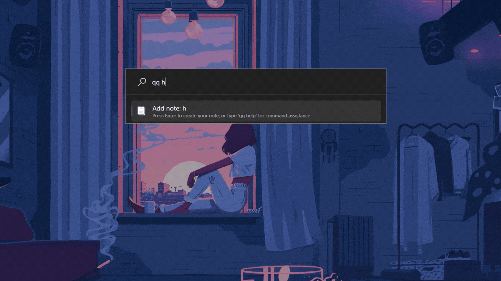
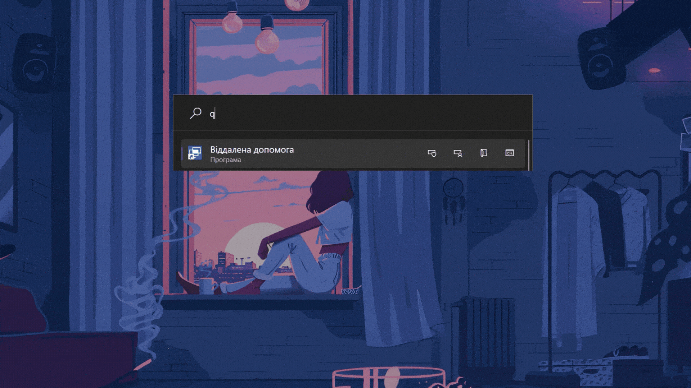
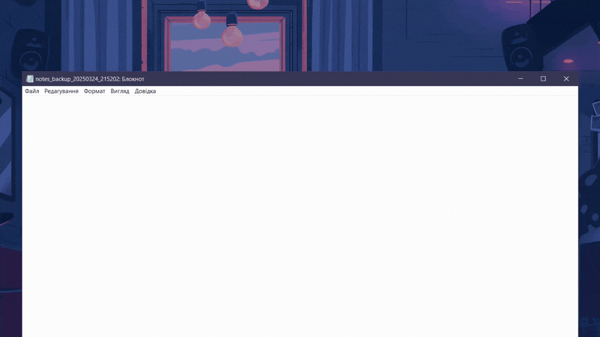
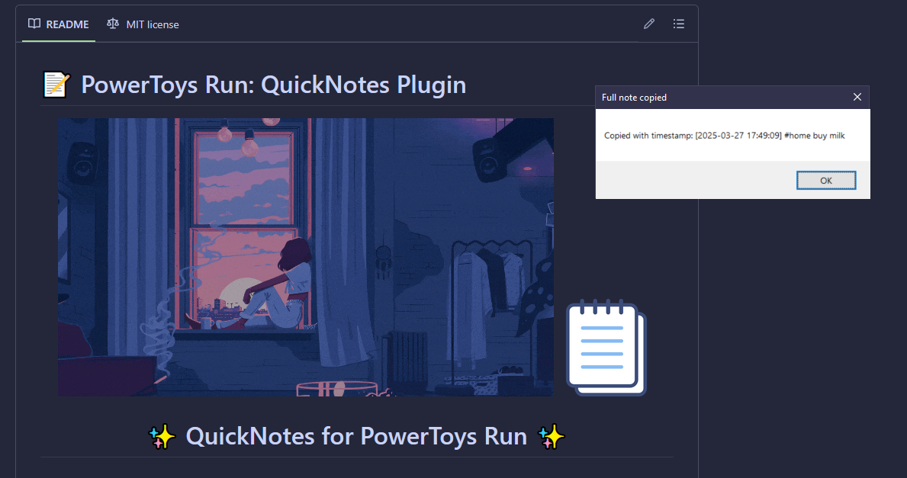
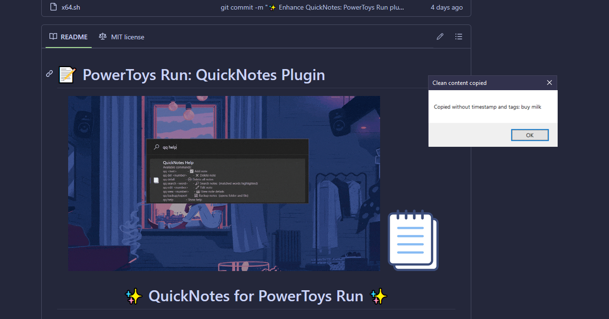
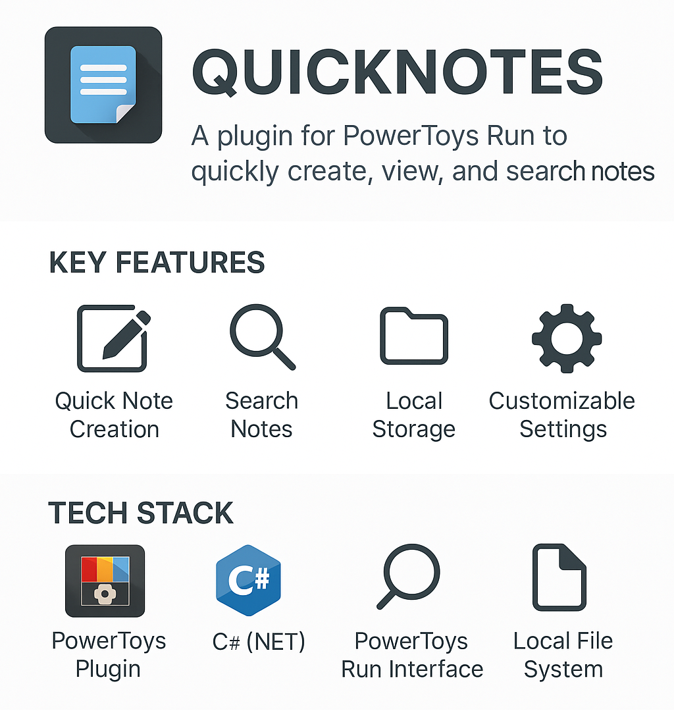
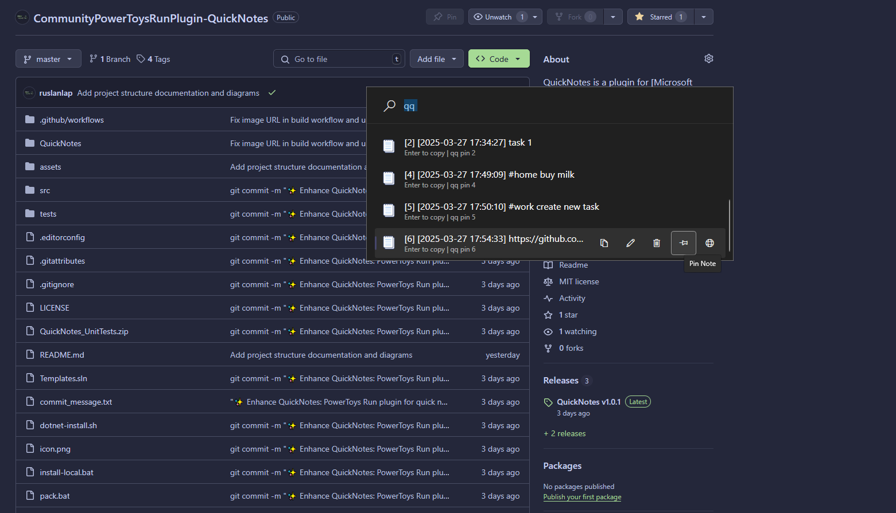
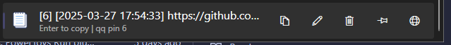

# 📝 PowerToys Run: QuickNotes Plugin

<div align="center">
  <!-- Full-width GIF -->
  

  <!-- Centered Logo -->
  
</div>

<div align="center">
  <h1>✨ QuickNotes for PowerToys Run ✨</h1>
  <h3>Create, manage, and search notes directly from PowerToys Run</h3>
  
  
  
  [](https://opensource.org/licenses/MIT)
  
  [](https://github.com/ruslanlap/CommunityPowerToysRunPlugin-QuickNotes/actions)
  
  
  
  [](https://github.com/ruslanlap/CommunityPowerToysRunPlugin-QuickNotes/stargazers)
  [](https://github.com/ruslanlap/CommunityPowerToysRunPlugin-QuickNotes/issues)
  [](https://github.com/ruslanlap/CommunityPowerToysRunPlugin-QuickNotes/releases/latest)
  [](https://github.com/ruslanlap/CommunityPowerToysRunPlugin-QuickNotes/releases)
  
  
</div>

> 🚀 **New in v1.0.8**: Fixed issues with duplicate timestamps when editing notes and improved the export functionality. The edit dialog behavior has been enhanced to prevent multiple dialogs from opening. [See changelog](https://github.com/ruslanlap/CommunityPowerToysRunPlugin-QuickNotes/blob/main/CHANGELOG.md)
>
> 🔄 **Previous Update in v1.0.7**: Enhanced note deletion system with improved user experience. The deletion process now provides clearer confirmation dialogs, better error handling, and more reliable identification of notes using their unique IDs. [Release notes](https://github.com/ruslanlap/CommunityPowerToysRunPlugin-QuickNotes/blob/main/release_notes_v1.0.7.md)
>
> 📝 **v1.0.6**: Completely reworked note management system that fixes critical bugs with note deletion and editing. The plugin now reliably identifies notes by their content rather than position, ensuring operations always target the correct note.

## 📚 Documentation & Wiki

Looking for detailed documentation, usage examples, or troubleshooting? Check out the full [QuickNotes Wiki](https://github.com/ruslanlap/CommunityPowerToysRunPlugin-QuickNotes/wiki) for:

- [Installation instructions](https://github.com/ruslanlap/CommunityPowerToysRunPlugin-QuickNotes/wiki/Installation)
- [Main commands & usage](https://github.com/ruslanlap/CommunityPowerToysRunPlugin-QuickNotes/wiki/Commands)
- [Features](https://github.com/ruslanlap/CommunityPowerToysRunPlugin-QuickNotes/wiki/Features)
- [FAQ](https://github.com/ruslanlap/CommunityPowerToysRunPlugin-QuickNotes/wiki/FAQ)
- [Troubleshooting](https://github.com/ruslanlap/CommunityPowerToysRunPlugin-QuickNotes/wiki/Troubleshooting)
- [Contributing guidelines](https://github.com/ruslanlap/CommunityPowerToysRunPlugin-QuickNotes/wiki/Contributing)

## 📋 Table of Contents

- [📋 Overview](#-overview)
- [⚡ Easy Install](#-easy-install)
- [✨ Features](#-features)
- [🎬 Demo Gallery](#-demo-gallery)
- [🚀 Installation](#-installation)
- [🔧 Usage](#-usage)
- [📁 Data Storage](#-data-storage)
- [🛠️ Building from Source](#️-building-from-source)
- [📊 Project Structure](#-project-structure)
- [🤝 Contributing](#-contributing)
- [❓ FAQ](#-faq)
- [✨ Why You'll Love QuickNotes](#-why-youll-love-quicknotes)
- [☕ Support & Donate](#-support--donate)
- [📄 License](#-license)
- [🙏 Acknowledgements](#-acknowledgements)
- [🛠️ Implementation Details](#-implementation-details)

## 📋 Overview

QuickNotes is a plugin for [Microsoft PowerToys Run](https://github.com/microsoft/PowerToys) that allows you to quickly create, manage, and search notes directly from your PowerToys Run interface. Simply type `qq` followed by your note text to save it, or use various commands to manage your notes collection.

<div align="center">
  
</div>

## ⚡ Easy Install

<div align="">
  <a href="https://github.com/ruslanlap/CommunityPowerToysRunPlugin-QuickNotes/releases/download/v1.0.8/QuickNotes-v1.0.8-x64.zip">
    
  </a>
  
  <p>
    <b>Quick Installation Steps:</b><br>
    1. Download using the button above<br>
    2. Extract to <code>%LOCALAPPDATA%\Microsoft\PowerToys\PowerToys Run\Plugins\</code><br>
    3. Restart PowerToys<br>
    4. Start using with <code>Alt+Space</code> then type <code>qq</code>
  </p>
</div>

### Quick Installation

<div align="center">
  <a href="https://github.com/ruslanlap/CommunityPowerToysRunPlugin-QuickNotes/releases/latest">
    
  </a>
</div>

## ✨ Features

- 📝 **Quick Note Creation** - Instantly save notes with a simple command
- 🔍 **Powerful Search** - Find notes with highlighted search terms
- 🏷️ **Tag Support** - Add #tags to notes and search by tag
- 📌 **Pin Important Notes** - Pin critical notes to keep them at the top
- 🔄 **Sorting Options** - Sort notes by date or alphabetically
- ✏️ **Easy Editing** - Modify existing notes with a simple interface
- 🗑️ **Enhanced Note Deletion** - Delete individual notes with improved confirmation dialogs, better error handling, and reliable ID-based identification
- ↩️ **Undo Delete** - Restore recently deleted notes
- 💾 **Simple Backup** - Create backups of your notes collection and view them in File Explorer
- 📋 **Clipboard Integration** - Copy notes to clipboard with a single click
- 🌓 **Theme Support** - Works with both light and dark PowerToys themes
- ⏱️ **Timestamp Recording** - Each note is saved with a timestamp for easy reference
- 🔔 **Notification System** - Get confirmation when notes are saved, edited, or deleted
- 🔗 **URL Detection** - Automatically detects and allows opening URLs in notes
- ✨ **Text Formatting** - Format notes with Markdown-style syntax for bold, italic, and highlights
- 🏷️ **Customizable Tag Style** - Toggle between bold or italic formatting for tags
- 💡 **Command Auto-suggestions** - Get real-time command suggestions as you type use Tab key it's easy

## 🎬 Demo Gallery

<div align="center">
  <h3>📝 Creating Notes</h3>
  <p></p>
  <p><i>Simply type <code>qq</code> followed by your note text to save it instantly</i></p>
  
  <h3>🔍 Searching Notes</h3>
  <p></p>
  <p><i>Use <code>qq search &lt;term&gt;</code> to find notes with highlighted matches</i></p>

  <h3>✏️ Editing Notes</h3>
  <p></p>
  <p></p>
  <p><i>Edit existing notes with <code>qq edit &lt;number&gt;</code></i></p>

  <h3>🗑️ Deleting Notes</h3>
  <p></p>
  <p><i>Delete notes with <code>qq del &lt;number&gt;</code> or all notes with <code>qq delall</code></i></p>

  <h3>💾 Exporting Notes</h3>
  <p></p>
  <p><i>Create backups with <code>qq backup</code> or <code>qq export</code></i></p>
  
  <h3>📋 Copying Notes</h3>
  <p></p>
  <p><i>Copy notes with timestamp included</i></p>
  
  <p></p>
  <p><i>Copy notes without timestamp and tags</i></p>
  
  <h3>👀 Viewing Notes</h3>
  <p><i>View note details with <code>qq view &lt;number&gt;</code></i></p>
    <p></p>
  
  <h3>❓ Help Command</h3>
  <p></p>
  <p><i>Get help on available commands with <code>qq help</code></i></p>
  
  <h3>✨ Text Formatting</h3>
  <p><i>Format your notes with <code>**bold**</code>, <code>*italic*</code>, <code>==highlight==</code>, and <code>#tags</code></i></p>
  
  <h3>💡 Command Auto-suggestions</h3>
  <p></p>
  <p><i>Get command suggestions as you type for faster note-taking</i></p>
</div>

## 🚀 Installation

### 📋 Prerequisites

- [Microsoft PowerToys](https://github.com/microsoft/PowerToys) installed
- Windows 10 or later

### 📥 Installation Steps

1. Download the latest release from the [Releases page](https://github.com/ruslanlap/CommunityPowerToysRunPlugin-QuickNotes/releases/latest)
2. Extract the ZIP file to:
   ```
   %LOCALAPPDATA%\Microsoft\PowerToys\PowerToys Run\Plugins\
   ```
3. Restart PowerToys

## 🔧 Usage

1. Open PowerToys Run (default: <kbd>Alt</kbd> + <kbd>Space</kbd>)
2. Use the following commands:

<div align="center">

| Command | Description | Example |
|---------|-------------|---------|
| `qq <text>` | Create a new note | `qq Buy milk and eggs` |
| `qq help` | Show help information | `qq help` |
| `qq search <term>` | Search notes (matched words highlighted) | `qq search milk` |
| `qq searchtag <tag>` | Search notes by tag | `qq searchtag work` |
| `qq view <number>` | View note details | `qq view 1` |
| `qq edit <number>` | Edit a specific note | `qq edit 2` |
| `qq del <number>` | Delete a specific note | `qq del 3` |
| `qq delall` | Delete all notes | `qq delall` |
| `qq undo` | Restore last deleted note | `qq undo` |
| `qq pin <number>` | Pin a note to the top | `qq pin 4` |
| `qq unpin <number>` | Unpin a note | `qq unpin 4` |
| `qq sort date` | Sort notes by date | `qq sort date` |
| `qq sort alpha` | Sort notes alphabetically | `qq sort alpha` |
| `qq backup` or `qq export` | Backup notes (opens file explorer) | `qq backup` |
| `qq tagstyle bold` | Set tag style to bold | `qq tagstyle bold` |
| `qq tagstyle italic` | Set tag style to italic | `qq tagstyle italic` |

</div>

### 🎯 Quick Tips

- Press <kbd>Enter</kbd> on a note to copy it to clipboard
- Right-click on a note for additional options (copy, edit, delete, pin/unpin)
- Add #tags to your notes (e.g., `qq Meeting with John #work #important`)
- Use `qq searchtag work` to find all notes with the #work tag
- Notes are automatically saved with timestamps
- Pinned notes always appear at the top of your notes list
- Sort notes with `qq sort date` (newest first) or `qq sort alpha` (A-Z)
- Add `desc` to sort in reverse order (e.g., `qq sort date desc`)
- Use `qq undo` to restore the last deleted note
- URLs in notes are automatically detected and can be opened via the context menu
- Use `qq help` anytime to see all available commands
- Type any command partially to see auto-suggestions (e.g., type `qq s` to see `search`, `sort`, etc.)
- Format your notes with Markdown-style syntax:
  - **Bold text**: Use `**text**` or `__text__`
  - *Italic text*: Use `*text*` or `_text_`
  - ==Highlighted text==: Use `==text==`
  - #tags are automatically formatted based on your tag style setting
- Toggle tag formatting style with `qq tagstyle bold` or `qq tagstyle italic`

- **Intelligent Copy Options**:
  - Press <kbd>Enter</kbd> on a note to copy clean content (without timestamp and tags)
  - Use <kbd>Ctrl</kbd>+<kbd>C</kbd> to copy the full note with timestamp
  - Use <kbd>Ctrl</kbd>+<kbd>Shift</kbd>+<kbd>C</kbd> for clean content (alternative to Enter)
  - Right-click menu provides all copy options with clear descriptions

## 📁 Data Storage

QuickNotes stores all your notes in a simple text file at:
```
%LOCALAPPDATA%\Microsoft\PowerToys\QuickNotes\notes.txt
```

Each note is stored with a timestamp for easy reference in the format:
```
[YYYY-MM-DD HH:MM:SS] Your note text here
```

Pinned notes are stored with a special prefix:
```
[PINNED] [YYYY-MM-DD HH:MM:SS] Your important note here
```

## 🛠️ Building from Source

### 📋 Prerequisites

- Visual Studio 2022 or later
- .NET SDK

### 🔨 Build Steps

1. Clone the repository:
   ```
   git clone https://github.com/ruslanlap/CommunityPowerToysRunPlugin-QuickNotes.git
   ```

2. Open the solution in Visual Studio

3. Build the solution:
   ```
   dotnet build -c Release
   ```

4. Find the output in the `bin/Release` directory

## 📊 Project Structure

The QuickNotes plugin has a clean, modular architecture designed for maintainability and extensibility.

<div align="center">
  
  <p><i>High-level project structure overview</i></p>

For a detailed breakdown of the project structure, see the [structure.md](structure.md) file.

</div>

> **ℹ️ Learn more about PowerToys Run plugins and discover other third-party plugins in the official [PowerToys Third-Party Plugins Directory](https://github.com/microsoft/PowerToys/blob/master/doc/thirdPartyRunPlugins.md).**

## 🤝 Contributing

Contributions are welcome! Please feel free to submit a Pull Request.

1. Fork the repository
2. Create your feature branch (`git checkout -b feature/amazing-feature`)
3. Commit your changes (`git commit -m 'Add some amazing feature'`)
4. Push to the branch (`git push origin feature/amazing-feature`)
5. Open a Pull Request


## ❓ FAQ

<details>
  <summary><b>How do I update the plugin?</b></summary>
  <p>Download the latest release and replace the files in your PowerToys Plugins directory. Restart PowerToys afterward.</p>
</details>

<details>
  <summary><b>Can I sync my notes across devices?</b></summary>
  <p>The plugin doesn't have built-in sync, but you can place the notes.txt file in a cloud-synced folder and create a symbolic link to it.</p>
</details>

<details>
  <summary><b>What if I accidentally delete all my notes?</b></summary>
  <p>If you've created backups using the <code>qq backup</code> command, you can restore from those. Otherwise, you might be able to recover from Windows File History if enabled.</p>
</details>

<details>
  <summary><b>Can I change the storage location?</b></summary>
  <p>Currently, the storage location is fixed. A future update may add customizable storage locations.</p>
</details>

## ✨ Why You'll Love QuickNotes

- **⚡ Lightning Fast** - From thought to saved note in under 3 seconds
- **🔍 Smart Search** - Find notes with highlighted search terms as you type
- **🧠 Distraction-Free** - No need to switch applications or contexts
- **🔄 Seamless Workflow** - Create, find, edit, and manage notes without leaving your keyboard
- **📋 Clipboard Integration** - Copy any note to clipboard with a single keystroke
- **🛠️ Powerfully Simple** - Sophisticated features hidden behind simple commands

<div align="center">
  
</div>

<div align="center">
  
  <p><i>**Powerful context menu features: Edit notes, Copy to clipboard, Pin important items, Delete notes, and Detect URL and Open URLs directly from your notes in your browser**</i></p>
</div>

**Feature Ideas We'd Love to See:**
- ~~Tag system for notes~~
- ~~Easy copy notes~~
- ~~Autosuggestions commands~~
- ~~Rich text formatting~~
- Cloud sync options
- Reminder functionality
- Git integration
- More effect 
- More styled
- ~~Notes to be pinned~~

## ☕ Support & Donate

If you find QuickNotes useful and want to support further development, you can buy me a coffee!

<p align="center">
  <a href="https://ruslanlap.github.io/ruslanlap_buymeacoffe/" target="_blank">
    
  </a>
</p>

Thank you for your support! ❤️

## 📄 License

This project is licensed under the MIT License - see the [LICENSE](LICENSE) file for details.

## 🙏 Acknowledgements

- [Microsoft PowerToys](https://github.com/microsoft/PowerToys) team for creating the extensible PowerToys Run platform
- All contributors who have helped improve this plugin
- Icons and visual elements from various open-source projects

## 🛠️ Implementation Details

The QuickNotes plugin is built around a robust and well-structured implementation in the `Main.cs` file, which serves as the heart of the plugin. Here's what makes it special:

### 🏗️ Architecture

- **Modular Design**: The code follows a clean, modular approach with well-defined responsibilities
- **NoteEntry Structure**: Uses a dedicated class to handle note metadata (timestamps, pinning status, etc.)
- **Command Pattern**: Implements a command-based architecture for all operations

### 🔑 Key Components

- **Command Processing**: Centralized command handling via the `GetCommandResults` method
- **Text Formatting**: Rich text formatting with support for bold, italic, highlighting, and tags
- **Context Menu**: Comprehensive right-click options for each note
- **File I/O**: Robust file operations with proper error handling
- **Theme Support**: Adapts to PowerToys light/dark themes automatically

### 🧩 Notable Features

- **Timestamp Management**: Automatically adds timestamps to notes and provides options to display or hide them
- **Tag Detection**: Identifies and formats #tags with customizable styling (bold or italic)
- **URL Detection**: Uses regex to find and make URLs clickable in notes
- **Undo Functionality**: Tracks deleted notes to enable undo operations
- **Sort Capabilities**: Implements flexible sorting by date or alphabetically
- **Autocomplete**: Provides intelligent command suggestions as you type


The implementation prioritizes user experience with features like:
- Clean content copying (stripping timestamps and tags)
- Intelligent display of pinned vs. regular notes
- Comprehensive error handling
- Helpful tooltips and notifications
- Flexible search capabilities

This robust architecture makes QuickNotes not just a simple note-taking plugin, but a powerful productivity tool that seamlessly integrates with PowerToys Run.

---

<div align="center">
  <p>Made with ❤️ by <a href="https://github.com/ruslanlap">ruslanlap</a></p>
  
  <a href="#-powertoys-run-quicknotes-plugin">Back to top ⬆️</a>
</div>