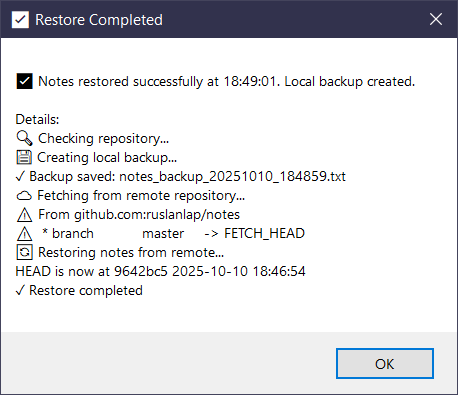

# 📝 PowerToys Run: QuickNotes Plugin

<div align="center">
  
  
  
  <h2>Create, manage, and search notes directly from PowerToys Run</h2>
  
  <div>
    <a href="https://github.com/ruslanlap/CommunityPowerToysRunPlugin-QuickNotes/releases/download/v1.0.12/QuickNotes-1.0.12-x64.zip">
      
    </a>
    <a href="https://github.com/ruslanlap/CommunityPowerToysRunPlugin-QuickNotes/releases/download/v1.0.12/QuickNotes-1.0.12-arm64.zip">
      
    </a>
  </div>
  
  <div>
    
    
    <a href="https://opensource.org/licenses/MIT">
      
    </a>
    
    <a href="https://github.com/ruslanlap/CommunityPowerToysRunPlugin-QuickNotes/actions">
      
    </a>
    
    
    
    <a href="https://github.com/ruslanlap/CommunityPowerToysRunPlugin-QuickNotes/stargazers">
      
    </a>
    <a href="https://github.com/ruslanlap/CommunityPowerToysRunPlugin-QuickNotes/issues">
      
    </a>
    <a href="https://github.com/ruslanlap/CommunityPowerToysRunPlugin-QuickNotes/releases/latest">
      
    </a>
    <a href="https://github.com/ruslanlap/CommunityPowerToysRunPlugin-QuickNotes/releases">
      
    </a>
    
    
    <a href="https://github.com/hlaueriksson/awesome-powertoys-run-plugins">
      
    </a>
  </div>
</div>

<details>
<summary>SHA256 Checksums</summary>

```text
# QuickNotes-1.0.12-x64.zip
# QuickNotes-1.0.12-arm64.zip
# Checksums will be generated during release build
```

</details>

<div align="center">
  
</div>

> 🆕 **v1.0.12**: Added Ukrainian localization 🇺🇦 with full translation support! Now QuickNotes speaks English, Chinese, and Ukrainian. [Full changelog](https://github.com/ruslanlap/CommunityPowerToysRunPlugin-QuickNotes/blob/master/Release.md/CHANGELOG.md)

> 📁 **v1.0.11**: Added customizable notes folder so you decide where `notes.txt` lives. Huge thanks to [@ShiSui97x](https://github.com/ShiSui97x) for the idea!

> 🚀 **v1.0.10 - MEGA RELEASE**: 🎉 **Git Sync Feature** - The game-changer you've been waiting for! Sync your notes across all devices with GitHub integration. Never lose a note again! [Full changelog](https://github.com/ruslanlap/CommunityPowerToysRunPlugin-QuickNotes/blob/master/Release.md/CHANGELOG.md)

> 🚀 **v1.0.9**: Improved multi-line notes with better code snippet support. [Full changelog](https://github.com/ruslanlap/CommunityPowerToysRunPlugin-QuickNotes/blob/master/Release.md/CHANGELOG.md)
>
> 🔄 **v1.0.8**: PowerToys Run plugin validation compliance, optimized dependencies
>
> 🔄 **v1.0.7**: Enhanced note deletion with better confirmation dialogs and ID-based identification
>
> 📝 **v1.0.6**: Reworked note management system fixing critical bugs with deletion and editing

## 📋 Overview

QuickNotes is a plugin for [Microsoft PowerToys Run](https://github.com/microsoft/PowerToys) that allows you to quickly create, manage, and search notes directly from your PowerToys Run interface. Simply type `qq` followed by your note text to save it, or use various commands to manage your notes collection.

## 📚 Documentation

For detailed documentation, visit the [QuickNotes Wiki](https://github.com/ruslanlap/CommunityPowerToysRunPlugin-QuickNotes/wiki).

## ⚡ Installation

### Quick Install

1. Download the [x64](https://github.com/ruslanlap/CommunityPowerToysRunPlugin-QuickNotes/releases/download/v1.0.12/QuickNotes-1.0.12-x64.zip) or [ARM64](https://github.com/ruslanlap/CommunityPowerToysRunPlugin-QuickNotes/releases/download/v1.0.12/QuickNotes-1.0.12-arm64.zip) version
2. Extract to `%LOCALAPPDATA%\Microsoft\PowerToys\PowerToys Run\Plugins\`
3. Restart PowerToys
4. Start using with `Alt+Space` then type `qq`

### PowerShell Installation

```powershell
# Download and install the latest version (x64)
$url = "https://github.com/ruslanlap/CommunityPowerToysRunPlugin-QuickNotes/releases/download/v1.0.12/QuickNotes-1.0.12-x64.zip"
$pluginPath = "$env:LOCALAPPDATA\Microsoft\PowerToys\PowerToys Run\Plugins\QuickNotes"
New-Item -ItemType Directory -Force -Path $pluginPath | Out-Null
Invoke-WebRequest -Uri $url -OutFile "$env:TEMP\QuickNotes.zip"
Expand-Archive -Path "$env:TEMP\QuickNotes.zip" -DestinationPath $pluginPath -Force
Remove-Item "$env:TEMP\QuickNotes.zip"
Write-Host "QuickNotes plugin has been installed. Please restart PowerToys." -ForegroundColor Green
```

## ✨ Features

- 🚀 **☁️ Git Sync** - **NEW!** Sync notes across all devices with GitHub integration
- 📝 **Quick Note Creation** - Instantly save notes with a simple command
- 🔍 **Powerful Search** - Find notes with highlighted search terms
- 🏷️ **Tag Support** - Add #tags to notes and search by tag
- 📌 **Pin Important Notes** - Pin critical notes to keep them at the top
- ✨ **Full Markdown Support** - Format with headers, code blocks, lists, and more
- 📝 **Multi-Line Notes** - Rich editor with live preview for longer notes
- 📋 **Clipboard Integration** - Copy notes with a single click
- 🔄 **Undo Delete** - Restore recently deleted notes
- 💾 **Simple Backup** - Create backups of your notes collection
- 📂 **Custom Storage Folder** - Choose the directory where your notes live right from PowerToys settings (thanks @ShiSui97x!)
- 🌍 **Multi-Language Support** - Available in English, Chinese (简体中文), and Ukrainian (Українська)

## 🔧 Usage

Open PowerToys Run (default: <kbd>Alt</kbd> + <kbd>Space</kbd>) and use these commands:

| Command | Description |
|---------|-------------|
| `qq <text>` | Create a new note |
| `qq help` | Show help information |
| `qq search <term>` | Search notes with highlighted matches |
| `qq searchtag <tag>` | Search notes by tag |
| `qq view <number>` | View note details |
| `qq edit <number>` | Edit a specific note |
| `qq del <number>` | Delete a specific note |
| `qq delall` | Delete all notes |
| `qq undo` | Restore last deleted note |
| `qq pin <number>` | Pin a note to the top |
| `qq unpin <number>` | Unpin a note |
| `qq sort date` | Sort notes by date |
| `qq sort alpha` | Sort notes alphabetically |
| `qq backup` | Backup notes |
| `qq markdown` | Create multi-line markdown note |
| `qq sync` | Sync notes to Git repository |
| `qq restore` | Restore notes from Git repository |

### 👉 Quick Tips

- Press <kbd>Enter</kbd> on a note to copy it to clipboard
- Right-click for more options (copy, edit, delete, pin/unpin)
- Add #tags to notes: `qq Meeting with John #work #important`
- Format with Markdown:
  - **Bold**: `**text**` or `__text__`
  - *Italic*: `*text*` or `_text_`
  - `Code`: `` `code` ``
  - Headers: `# Heading`
  - Lists: `- item` or `1. item`
- Use <kbd>Ctrl</kbd>+<kbd>C</kbd> to copy with timestamp
- Type `qq` then press <kbd>Tab</kbd> for command suggestions
- URLs in notes are automatically detected and clickable

## ☁️ Git Sync - 🚀 **MEGA FEATURE!**

**The game-changer you've been waiting for!** QuickNotes now supports syncing your notes to a Git repository. This is the ultimate way to back up your notes and sync them across multiple computers. Never lose a note again!

### Setup

1. **Enable Git Sync in Settings**:
    - Open PowerToys settings.
    - Go to the QuickNotes plugin settings.
    - Check the "Enable Git Sync" checkbox.
2. **Configure Git Settings**:
    - **Git Repository URL**: The URL of the Git repository you want to sync to. Both HTTPS and SSH URLs are supported. For example: `https://github.com/user/repo.git` or `git@github.com:user/repo.git`.
    - **Git Branch**: The branch you want to sync to. Defaults to `main`.
    - **Git Username**: Your Git username.
    - **Git Email**: Your Git email address.

### Usage

- `qq sync`: This command will commit and push your notes to the remote repository.
- `qq restore`: This command will pull the latest version of your notes from the remote repository. It will create a local backup of your notes before restoring.

**Authentication**: The plugin uses your system's Git credentials. If you are using HTTPS, it's recommended to use a Personal Access Token (PAT) instead of a password. For SSH, make sure your SSH key is configured correctly.

## 🎬 Demo

<div align="center">
  <p></p>
  <p><i>QuickNotes in action</i></p>
  
  <a href="https://github.com/ruslanlap/CommunityPowerToysRunPlugin-QuickNotes/tree/master/assets">
    
  </a>
</div>

## 📁 Data Storage

QuickNotes stores all your notes in a simple text file. By default it lives at:

```
%LOCALAPPDATA%\Microsoft\PowerToys\QuickNotes\notes.txt
```

Prefer a different location? Open PowerToys settings → QuickNotes → “Notes folder path” to point the plugin to any folder you like. The plugin will create the folder if it does not exist (idea credit: @ShiSui97x!).
```

## 🛠️ Building from Source

### Prerequisites

- Visual Studio 2022 or later
- .NET SDK
- [Microsoft PowerToys](https://github.com/microsoft/PowerToys) installed
- Windows 10 or later

### Build Steps

1. Clone the repository
2. Open the solution in Visual Studio
3. Build the solution: `dotnet build -c Release`

## 🤝 Contributing

Contributions are welcome! Please check the [Contributing Guidelines](wiki/Contributing.md) for more information.

## ❓ FAQ

<details>
  <summary><b>How do I update the plugin?</b></summary>
  <p>Download the latest release and replace the files in your PowerToys Plugins directory. Restart PowerToys afterward.</p>
</details>

<details>
  <summary><b>Can I sync my notes across devices?</b></summary>
  <p>Yes, you can use the built-in Git Sync feature to sync your notes across devices. See the "Git Sync" section for more details.</p>
</details>

<details>
  <summary><b>What if I accidentally delete all my notes?</b></summary>
  <p>If you've created backups using the <code>qq backup</code> command, you can restore from those. If you are using Git Sync, you can restore your notes from the remote repository using `qq restore`. Otherwise, you might be able to recover from Windows File History if enabled.</p>
</details>

<details>
  <summary><b>Can I change the storage location?</b></summary>
  <p>Yes! Set the “Notes folder path” option in PowerToys → QuickNotes settings. Leave it empty to keep the default AppData folder.</p>
</details>

## 📄 License

This project is licensed under the MIT License - see the [LICENSE](LICENSE) file for details.

## 🙏 Acknowledgements

- [Microsoft PowerToys](https://github.com/microsoft/PowerToys) team for creating the extensible PowerToys Run platform
- All contributors who have helped improve this plugin
- Special thanks to [@ShiSui97x](https://github.com/ShiSui97x) for inspiring the configurable notes folder feature
- Icons and visual elements from various open-source projects

---

<div align="center">
  <h2>📥 Download Latest Version</h2>
  
  <a href="https://github.com/ruslanlap/CommunityPowerToysRunPlugin-QuickNotes/releases/download/v1.0.12/QuickNotes-1.0.12-x64.zip">
    
  </a>
  
  <a href="https://github.com/ruslanlap/CommunityPowerToysRunPlugin-QuickNotes/releases/download/v1.0.12/QuickNotes-1.0.12-arm64.zip">
    
  </a>
  
  <a href="https://github.com/ruslanlap/CommunityPowerToysRunPlugin-QuickNotes/releases/latest">
    
  </a>
  
  <p>Made with ❤️ by <a href="https://github.com/ruslanlap">ruslanlap</a></p>
  
  <a href="#-powertoys-run-quicknotes-plugin">Back to top ⬆️</a>
</div>

## 📄 License

This project is licensed under the MIT License - see the [LICENSE](LICENSE) file for details.

## 🙏 Acknowledgements

- [Microsoft PowerToys](https://github.com/microsoft/PowerToys) team for creating the extensible PowerToys Run platform
- All contributors who have helped improve this plugin
- Special thanks to [@ShiSui97x](https://github.com/ShiSui97x) for inspiring the configurable notes folder feature
- Icons and visual elements from various open-source projects

### 🧩 Notable Features

- **Timestamp Management**: Automatically adds timestamps to notes and provides options to display or hide them
- **Tag Detection**: Identifies and formats #tags with customizable styling (bold or italic)
- **URL Detection**: Uses regex to find and make URLs clickable in notes
- **Undo Functionality**: Tracks deleted notes to enable undo operations
- **Sort Capabilities**: Implements flexible sorting by date or alphabetically
- **Autocomplete**: Provides intelligent command suggestions as you type

The implementation prioritizes user experience with features like:

- Clean content copying (stripping timestamps and tags)
- Intelligent display of pinned vs. regular notes
- Comprehensive error handling
- Helpful tooltips and notifications
- Flexible search capabilities

This robust architecture makes QuickNotes not just a simple note-taking plugin, but a powerful productivity tool that seamlessly integrates with PowerToys Run.

For more detailed implementation information, see the [IMPLEMENTATION_SUMMARY.md](docs/IMPLEMENTATION_SUMMARY.md) file.
